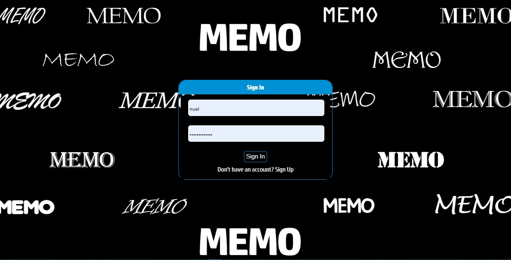
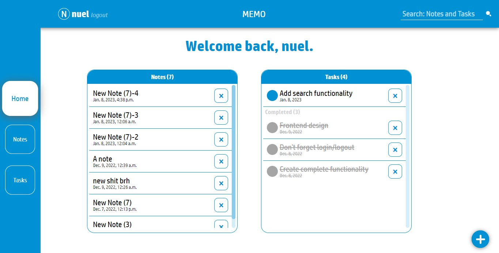
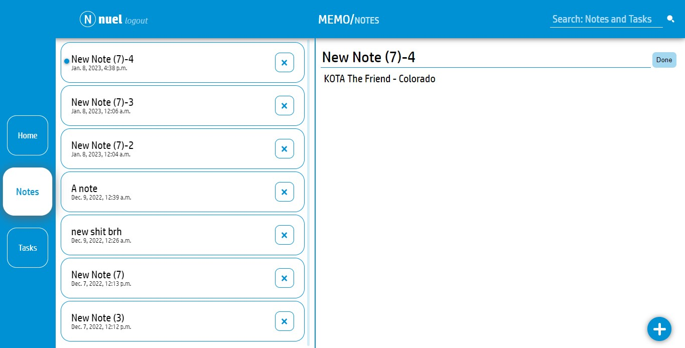
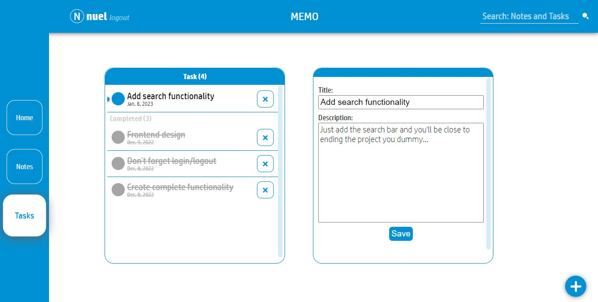

# Memo

Memo is a notes/todolist app that allows users to login and create their notes, edit or delete notes or tasks.

## Features

- User authentication: users can sign up and log in to their accounts.
- Notes management: users can create, read, update, and delete notes.
- Tasks management: users can create, read, update, and delete tasks.
- Search functionality: users can search for specific notes or tasks.
- Responsive design: the app is optimized for desktop and mobile devices.

## Technologies used

- Python 3
- Django
- HTML/CSS
- JavaScript
- SQLite

## Screen Shots
<table>
  <tr>
    <td></td>
    <td></td>
  </tr>
</table>
<table>
  <tr>
    <td></td>
    <td></td>
  </tr>
</table>


## Installation

1. Clone the repository:

```git clone https://github.com/WalterNuel/memo.git```

2. Run the development server:

```python manage.py runserver```

3. Open your web browser and go to http://localhost:8000.

## How to use

1. Sign up for an account or log in if you already have one.
2. Create a note by clicking the "New note" button and filling out the form.
3. View your notes by clicking the "View all notes" button.
4. Edit or delete a note by clicking the corresponding buttons next to the note.
5. Create a task by clicking the "New task" button and filling out the form.
6. View your tasks by clicking the "View all tasks" button.
7. Edit or delete a task by clicking the corresponding buttons next to the task.
